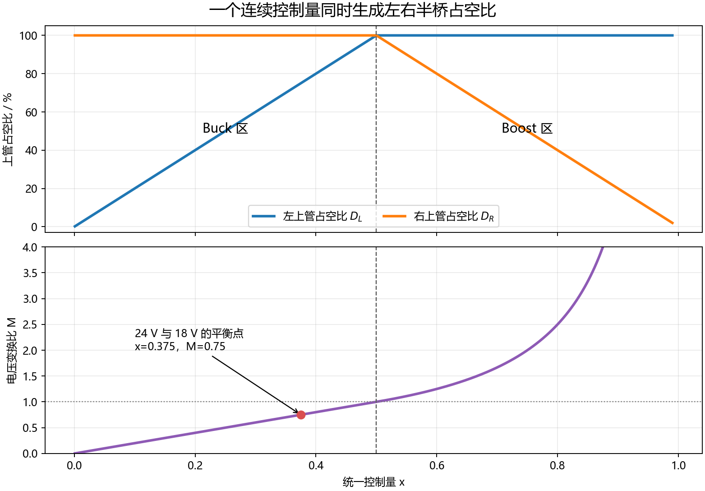
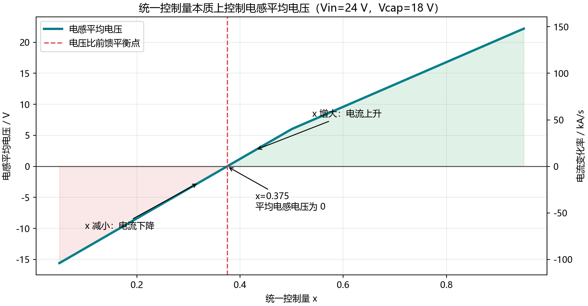
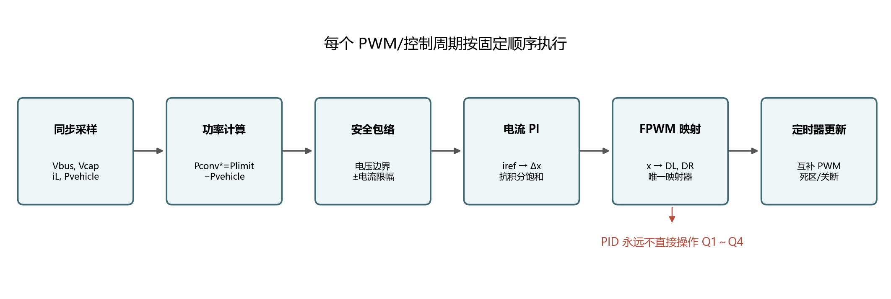

# FPWM 统一调制与模式状态机

## 1. 文档目录

1. [问题是什么](#2-问题是什么)
2. [四开关统一模型](#3-四开关统一模型)
3. [方案一：FPWM 统一调制](#4-方案一fpwm-统一调制)
4. [FPWM 如何避免错误模式](#5-fpwm-如何避免错误模式)
5. [FPWM 仍然需要的保护](#6-fpwm-仍然需要的保护)
6. [方案二：模式状态机](#7-方案二模式状态机)
7. [两种方案对比](#8-两种方案对比)
8. [本项目推荐结构](#9-本项目推荐结构)
9. [软件实现顺序](#10-软件实现顺序)

本文建议先记住一句话：**四开关有两个桥臂，但快速电流环实际只需要控制电感两端的一个平均电压差，所以可以用一个连续变量统一描述。**

## 2. 问题是什么

不推荐使用下面的逻辑：

```text
if PID_output < 某个值:
    切换到 Buck MOS 组合
else:
    切换到 Boost MOS 组合
```

PID 输出包含比例项和积分项。车辆功率阶跃、采样噪声、启动过程或积分饱和都可能使输出瞬间跨过判断边界。如果开关组合也跟随这个瞬间结果切换，就可能出现：

- 电压关系明显属于 Buck，程序却突然启用 Boost 开关序列；
- 边界附近一个控制周期 Buck、下一个周期 Boost；
- 切换前后的积分器状态不匹配，占空比跳变；
- 两侧下管时序处理错误，造成异常电感电流；
- 错误模式持续到积分器退出饱和。

控制器和 PWM 调制器应当分层：PID 只表达“希望电感电流增加还是减小”，PWM 调制器负责把一个连续控制量安全地转换为四个 MOS 的驱动时序。

## 3. 四开关统一模型

### 3.1 从电路连接看


每个半桥的上、下管互补工作。控制器不分别命令 Q1、Q2、Q3、Q4，而是把连续变量交给唯一的 FPWM 映射器，再由映射器和高级定时器产生互补 PWM、死区及故障关断。

定义左侧上管占空比：

$$
D_L
$$

定义右侧上管占空比：

$$
D_R
$$

电感平均模型为：

$$
L\frac{di_L}{dt}=D_LV_{left}-D_RV_{right}-R_Li_L
$$

忽略电感损耗，在稳态时有：

$$
D_LV_{left}=D_RV_{right}
$$

因此：

$$
\frac{V_{right}}{V_{left}}=\frac{D_L}{D_R}
$$

这条关系同时覆盖 Buck、Boost、充电和放电。Buck/Boost 描述的是两侧电压关系；电流正负描述的是能量流向。这两件事不能混为一谈。

### 3.2 明明有两个占空比，为什么只需要一个控制量

在一个 PWM 周期内，两侧电压相对电感电流变化得很慢，可以近似看成常数。电感电流变化只由下面这个平均电压决定：

$$
V_{L,avg}=D_LV_{left}-D_RV_{right}
$$

电流变化率为：

$$
\frac{di_L}{dt}=\frac{V_{L,avg}-R_Li_L}{L}
$$

对于快速电流环来说，真正需要控制的是一个量：

$$
V_{L,avg}
$$

虽然硬件上存在两个占空比，但如果让 PID 独立计算两个输出，系统会出现无穷多组可能组合，控制器还必须额外决定哪一组更安全。FPWM 映射器预先规定一条唯一轨迹：

$$
x\longrightarrow(D_L,D_R)
$$

于是两个占空比不再是两个独立自由度，而是同一个变量在两个桥臂上的展开。PID 只要让控制量增大或减小，就能单调地改变电感平均电压，进而改变电流。



## 4. 方案一：FPWM 统一调制

### 4.1 核心思想

定义一个连续控制变量：

$$
0\leq x\leq1
$$

PID 不输出“Buck”或“Boost”，只输出这个连续变量的修正量。调制器统一完成左右桥臂映射。

当控制变量位于前半区时：

$$
0\leq x\leq0.5
$$

占空比映射为：

$$
D_L=2x
$$

$$
D_R=1
$$

此时右侧上管保持导通，左半桥互补 PWM，等效为同步 Buck。

当控制变量位于后半区时：

$$
0.5<x\leq1
$$

占空比映射为：

$$
D_L=1
$$

$$
D_R=2-2x
$$

此时左侧上管保持导通，右半桥互补 PWM。若 GUI 显示的是右侧下管 Boost 占空比，则：

$$
D_{Boost}=1-D_R=2x-1
$$

在中点处两组公式连续：

$$
x=0.5
$$

$$
D_L=D_R=1
$$

因此不存在从一个完全不同的 PID 输出突然跳到另一个 PID 输出的问题。

### 4.2 电压比前馈

定义两侧电压比：

$$
M=\frac{V_{right}}{V_{left}}
$$

当电压比不大于 1 时，前馈控制量为：

$$
x_{ff}=\frac{M}{2}
$$

当电压比大于 1 时，前馈控制量为：

$$
x_{ff}=1-\frac{1}{2M}
$$

电流控制器只需要在前馈附近进行修正：

$$
e_i=i_L^{*}-i_L
$$

$$
\Delta x=K_pe_i+K_i\int e_i\,dt
$$

$$
x_{cmd}=x_{ff}+\Delta x
$$

这样，前馈负责给出基本电压平衡点，PI 负责产生使电流收敛的电感平均电压差。

## 5. FPWM 如何避免错误模式

FPWM 的关键不是保证控制变量永远停留在某个半区，而是让控制变量跨越中点时仍然具有连续、唯一且安全的 PWM 含义。

例如当前电压关系属于 Buck，但车辆负载突然变化，电流 PI 可能短暂把控制变量推过中点。在 FPWM 中，这不是软件误调用了另一套 Boost PID；它只是统一调制变量继续增大，PWM 映射器连续改变两侧桥臂的平均电压，用更大的电感电压快速修正电流。

模式选择不再散落在 PID 代码中。唯一允许决定四个 MOS 状态的是统一调制器：

```text
功率指令
  → 电流参考
  → 电流 PI
  → 连续变量 x
  → 唯一的 FPWM 映射器
  → 左右桥臂互补 PWM
```

因此需要禁止下面两种做法：

- 在 PID 函数内部直接写 MOS 开关状态；
- Buck 和 Boost 各保存一个不相关的积分器，然后按 PID 输出硬切换。

### 5.1 一个具体数值例子

假设母线电压、超级电容电压和电感分别为：

$$
V_{left}=24\ \mathrm{V}
$$

$$
V_{right}=18\ \mathrm{V}
$$

$$
L=150\ \mathrm{\mu H}
$$

电压比为：

$$
M=\frac{18}{24}=0.75
$$

因此 Buck 区的前馈控制量为：

$$
x_{ff}=\frac{0.75}{2}=0.375
$$

对应占空比为：

$$
D_L=2x=0.75
$$

$$
D_R=1
$$

电感平均电压为：

$$
V_{L,avg}=0.75\times24-1\times18=0\ \mathrm{V}
$$

忽略损耗时，电感电流保持不变。

如果实际电流低于目标，PI 将控制量提高到：

$$
x=0.40
$$

此时：

$$
V_{L,avg}=0.80\times24-18=1.2\ \mathrm{V}
$$

电流开始上升：

$$
\frac{di_L}{dt}=\frac{1.2}{150\times10^{-6}}=8000\ \mathrm{A/s}
$$

若控制周期为 50 微秒，一个周期的电流增量约为：

$$
\Delta i_L=8000\times50\times10^{-6}=0.4\ \mathrm{A}
$$

反过来，如果电流高于目标，PI 将控制量降低到：

$$
x=0.35
$$

此时电感平均电压为：

$$
V_{L,avg}=0.70\times24-18=-1.2\ \mathrm{V}
$$

电流就会下降。由此可见，PID 并不需要理解“现在应该操作哪一个 MOS”；它只需要根据电流误差增减同一个控制量。



### 5.2 跨过中点为什么不是错误切换

控制量接近中点时：

$$
x\approx0.5
$$

左桥占空比逐渐接近固定导通，之后右桥开始逐渐增加下管占空比。两个映射公式在中点连续，因此不会出现“先关闭一套控制器，再启动另一套控制器”的离散事件。

实际硬件受最大 PWM 占空比和死区限制，不能让正在 PWM 的桥臂无限接近 100%。通常会在中点附近设置一个双桥共同调制区，使一个桥臂退出 PWM 的同时另一个桥臂平滑接管。这个过渡只属于调制器，不属于 PID。

## 6. FPWM 仍然需要的保护

FPWM 消除了离散模式误判，但不能替代安全保护。

### 6.1 控制量限幅

$$
x_{cmd}=\operatorname{sat}(x_{cmd},x_{min},x_{max})
$$

### 6.2 PI 修正量限幅

为了避免控制器在严重异常时离开前馈点太远，可以限制：

$$
-\Delta x_{max}\leq\Delta x\leq\Delta x_{max}
$$

### 6.3 变化率限制

$$
\left|\frac{x[k]-x[k-1]}{T_s}\right|\leq S_{max}
$$

### 6.4 双向电流限制

$$
-I_{discharge,max}\leq i_L^{*}\leq I_{charge,max}
$$

### 6.5 积分抗饱和

控制量达到上下限后，只允许积分器向退出饱和的方向更新。

### 6.6 硬件 PWM 安全

- 上下管必须由同一高级定时器产生互补 PWM；
- 必须插入死区；
- 禁止使用普通 GPIO 顺序翻转上下管；
- 过流比较器应能绕过软件直接关断 PWM；
- ADC 丢失、数值非有限或通信超时后进入安全占空比或关断状态。

### 6.7 超级电容边界

达到最高电压后不允许继续充电，达到最低电压后不允许继续放电。功率控制器必须先经过安全包络，再生成电流参考。

## 7. 方案二：模式状态机

模式状态机明确维护三种状态：

```text
BUCK ↔ TRANSITION ↔ BOOST
```

状态由实测电压比决定，而不是 PID 输出决定：

$$
M_{measure}=\frac{V_{right}}{V_{left}}
$$

一个带滞回的示例为：

$$
M_{measure}\geq0.90:\quad Buck\rightarrow Transition
$$

$$
M_{measure}\leq0.86:\quad Transition\rightarrow Buck
$$

$$
M_{measure}\geq1.10:\quad Transition\rightarrow Boost
$$

$$
M_{measure}\leq1.06:\quad Boost\rightarrow Transition
$$

此外还要加入：

- 最小驻留时间；
- 模式合法占空比限制；
- 切换时积分器跟踪，实现无扰切换；
- 过渡区内两侧桥臂的相位和占空比协调；
- 采样滤波和异常值处理。

状态机方案可以让非参与调制的桥臂保持常导通或关断，从而降低开关损耗。但逻辑更多，模式边界、滞回和积分器处理不正确时，仍可能出现切换问题。

## 8. 两种方案对比

| 项目 | FPWM 统一调制 | 模式状态机 |
|---|---|---|
| PID 输出 | 单一连续变量 | 当前模式内的修正量 |
| 模式判断 | 不要求 PID 判模式 | 实测电压比 + 状态机 |
| 跨区连续性 | 天然连续 | 需要无扰切换 |
| 轻载效率 | 较低 | 较高 |
| 反向电流 | 天然支持 | 需要各模式都正确支持 |
| 软件复杂度 | 较低 | 较高 |
| 边界抖动 | 不存在离散模式抖动 | 依赖滞回和驻留时间 |
| RoboMaster 快速功率控制 | 推荐 | 可用于效率优化版本 |
| 调试重点 | 电流环、限幅、硬件保护 | 模式边界、积分器、切换时序 |

## 9. 本项目推荐结构

本项目更适合优先采用 FPWM 统一调制：

```text
车辆功率测量
  → 计算超级电容目标功率
  → 换算双向电流参考
  → 单一电流 PI
  → 电压比前馈 + PI 修正
  → FPWM 统一映射
  → HRTIM/高级定时器互补输出
```

状态机方案保留为对照和后续效率优化方案。第一阶段应先把电流方向、功率符号、安全限流和 FPWM 映射验证正确，再考虑在轻载工况切换到更高效率的工作模式。

## 10. 软件实现顺序

### 10.1 从采样到 PWM 的完整信号链



建议使用中心对齐 PWM，并由定时器在固定载波位置触发 ADC。这样每次采样对应相同的开关相位，电流纹波引入的测量偏差更稳定。

ADC 每周期至少提供：

$$
V_{bus},\quad V_{cap},\quad i_L
$$

车辆功率可以来自母线电压与车辆电流测量：

$$
P_{vehicle}=V_{bus}I_{vehicle}
$$

也可以来自上层底盘控制器通过 CAN 给出的功率估算。无论来源如何，都要经过超时和范围检查。

### 10.2 每周期的计算逻辑

推荐每个控制周期严格按下面顺序执行：

1. 读取母线电压、超级电容电压、电感电流和车辆功率；
2. 对 ADC 结果做范围检查并处理无效值；
3. 根据功率限制计算目标超级电容功率；
4. 经过超电电压和电流安全包络；
5. 将目标功率换算为目标电感电流；
6. 计算电压比前馈；
7. 电流 PI 只输出连续修正量；
8. 对修正量、总控制量和变化率限幅；
9. 统一调制器生成左右桥臂占空比；
10. 高级定时器负责互补输出、死区和硬件故障关断。

对应伪代码如下：

```c
// 由 PWM 定时器固定位置触发，每个控制周期执行一次
sample = adc_read_synchronized();

if (!sample_is_valid(sample)) {
    pwm_enter_safe_state();
    return;
}

vehicle_power = sample.bus_voltage * sample.vehicle_current;
converter_power_ref = power_limit - vehicle_power;
converter_power_ref = apply_cap_voltage_envelope(converter_power_ref,
                                                 sample.cap_voltage);

current_ref = power_to_inductor_current(converter_power_ref,
                                        sample.bus_voltage,
                                        previous_d_left);
current_ref = clamp(current_ref, -discharge_current_max,
                                 charge_current_max);

current_error = current_ref - sample.inductor_current;
x_feedforward = voltage_ratio_to_x(sample.cap_voltage /
                                   sample.bus_voltage);
x_correction = current_pi_update(current_error);
x_correction = clamp(x_correction, -delta_x_max, delta_x_max);

x_command = slew_limit(x_feedforward + x_correction,
                       previous_x_command);
x_command = clamp(x_command, x_min, x_max);

duty = fpwm_map_x_to_two_bridges(x_command);
timer_write_preload(duty.d_left, duty.d_right);
```

### 10.3 各层分别负责什么

| 层级 | 输入 | 输出 | 不应该做的事 |
|---|---|---|---|
| 功率管理层 | 车辆功率、功率上限、超电电压 | 目标变换器功率 | 直接写 PWM |
| 电流参考层 | 目标功率、两侧电压 | 目标电感电流 | 直接决定 MOS 状态 |
| 电流 PI | 目标电流、实际电流 | 连续修正量 | 判断 Buck/Boost |
| FPWM 映射器 | 单一控制量 | 两个半桥占空比 | 保存功率积分器 |
| 高级定时器 | 两个占空比 | 四路互补栅极信号 | 执行业务控制逻辑 |

这种分层能保证 PID 计算异常时，异常值仍要经过修正量限幅、总量限幅、变化率限制和唯一 PWM 映射器，不能直接改变 MOS 组合。

参考资料：

- [香港科技大学 ENTERPRIZE RM2023 超级电容](https://github.com/hkustenterprize/RM2023-SuperCapacitor)
- [Pacific Spirit 2024 超级电容开源报告](https://bbs-web-static.robomaster.com/bbs-prod/e7f8d21beb8d4081ae0030fa63caae6d.pdf)
- [Pacific Spirit 超级电容固件](https://github.com/wele0612/PSP_supercapacitor)

